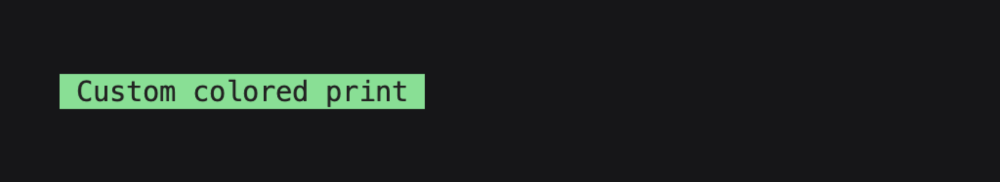
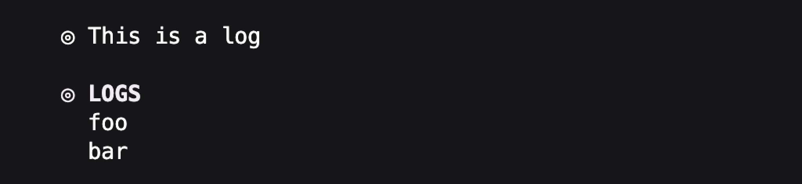
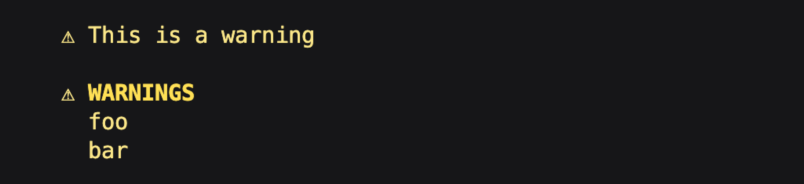
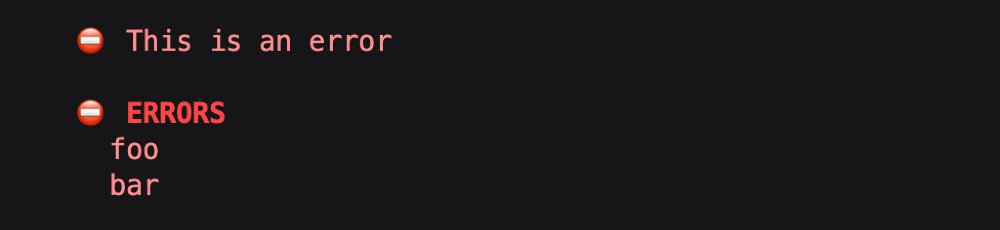
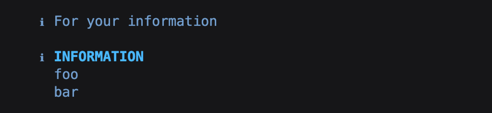
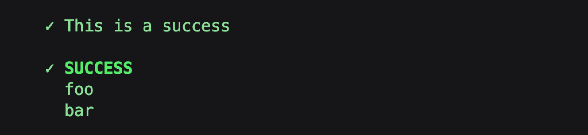
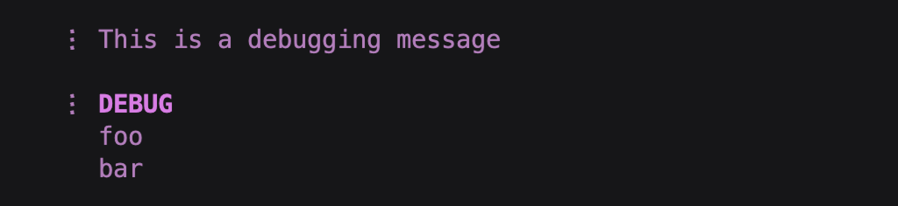
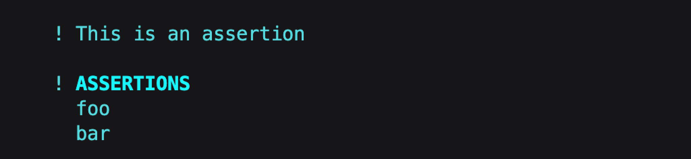
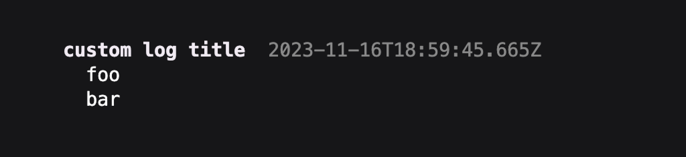

<a id="readme-top"></a>

[](https://opensource.org/licenses/MIT)

<div align="center">
  <h1 align="center">
    node-console  <span style="font-size: 12px; color: grey;">v1.0.0</span>
  </h1>
  <p>A prettier way to print messages to your node console.</p>
</div>
<br />

  <!-- TABLE OF CONTENTS -->
  <details>
    <summary style="font-size: 18px;">Table of Contents</summary>
    <ol>
      <li>
        <a href="#about-the-project">About The Project</a>
      </li>
      <li>
        <a href="#installation">Installation</a>
      </li>
      <li><a href="#usage">Usage</a></li>
      <li><a href="#contact">Contact</a></li>
    </ol>
  </details>
  <br/>

  <!-- ABOUT THE PROJECT -->

## About The Project

The motivation for this project is to offer a simple solution to printing well formatted and more informative console messages at ease, offering a better experience while developing `nodejs` apps.

  <p align="right" style="color: #5ce087;">
    [ <a href="#readme-top" style="color: #ffa7f6;">back to top</a> ]
  </p>

  <!-- Installation -->

## Installation

```
npm install --save-dev node-console

yarn add --dev node-console
```

  <p align="right" style="color: #5ce087;">
    [ <a href="#readme-top" style="color: #ffa7f6;">back to top</a> ]
  </p>

## Usage

### Default Configuration

```javascript
// ESM
import NodeLogger from 'node-console';
// CJS
const NodeLogger = require('node-console');

const logger = new NodeLogger();
```

```javascript
defaultLogger.print('black', 'green', 'Custom colored print');
```



```javascript
logger.log('This is a log');
logger.log('foo', 'bar');
```



```javascript
logger.warn('This is a warning');
logger.warn('foo', 'bar');
```



```javascript
logger.error('This is an error');
logger.error('foo', 'bar');
```



```javascript
logger.info('For your information');
logger.info('foo', 'bar');
```



```javascript
logger.success('This is a success');
logger.success('foo', 'bar');
```



```javascript
logger.debug('This is a debugging message');
logger.debug('foo', 'bar');
```



```javascript
logger.assert('This is an assertion');
logger.assert('foo', 'bar');
```



### Custom Configuration

| Property     |                                                                                                                                                            Type                                                                                                                                                             |                                                                                                                                                                                                                                                                                                                                            Default |
| ------------ | :-------------------------------------------------------------------------------------------------------------------------------------------------------------------------------------------------------------------------------------------------------------------------------------------------------------------------: | -------------------------------------------------------------------------------------------------------------------------------------------------------------------------------------------------------------------------------------------------------------------------------------------------------------------------------------------------: |
| useIcons     |                                                                                                                                                          `boolean`                                                                                                                                                          |                                                                                                                                                                                                                                                                                                                                             `true` |
| useTimestamp |                                                                                                      <table><tbody><tr><td>group</td><td>`boolean`</td></tr><tr><td>single</td><td>`boolean`</td></tr></tbody></table>                                                                                                      |                                                                                                                                                                                                                                      <table><tbody><tr><td>group</td><td>`false`</td></tr><tr><td>single</td><td>`false`</td></tr></tbody></table> |
| groupTitles  | <table><tbody><tr><td>log</td><td>`string`</td></tr><tr><td>warning</td><td>`string`</td></tr><tr><td>error</td><td>`string`</td></tr><tr><td>info</td><td>`string`</td></tr><tr><td>success</td><td>`string`</td></tr><tr><td>debug</td><td>`string`</td></tr><tr><td>assertion</td><td>`string`</td></tr></tbody></table> | <table><tbody><tr><td>log</td><td>`"LOGS"`</td></tr><tr><td>warning</td><td>`"WARNINGS"`</td></tr><tr><td>error</td><td>`"ERRORS"`</td></tr><tr><td>info</td><td>`""INFORMATION`</td></tr><tr><td>success</td><td>`"SUCCESS"`</td></tr><tr><td>debug</td><td>`"DEBUG"`</td></tr><tr><td>assertion</td><td>`"ASSERTIONS"`</td></tr></tbody></table> |

```javascript
const logger = new NodeLogger({
  useIcons: false,
  useTimestamp: { group: true, single: true },
  groupTitles: {
    log: 'custom log title',
  },
});
```



  <p align="right" style="color: #5ce087;">
    [ <a href="#readme-top" style="color: #ffa7f6;">back to top</a> ]
  </p>

## Contact

<a href="mailto:yoni@yondav.us" style="color: #ffa7f6;">
  yoni@yondav.us
</a>

  <p align="right" style="color: #5ce087;">
    [ <a href="#readme-top" style="color: #ffa7f6;">back to top</a> ]
  </p>
---

<div align="center">
  <p style="color: grey;">&#169; Yoni David 2023</p>
      <a
        href="https:yondav.us"
        target="_blank"
        rel="noopener noreferrer"
        style="color: #ffa7f6;"
      >
        yondav.us
      </a>
</div>
